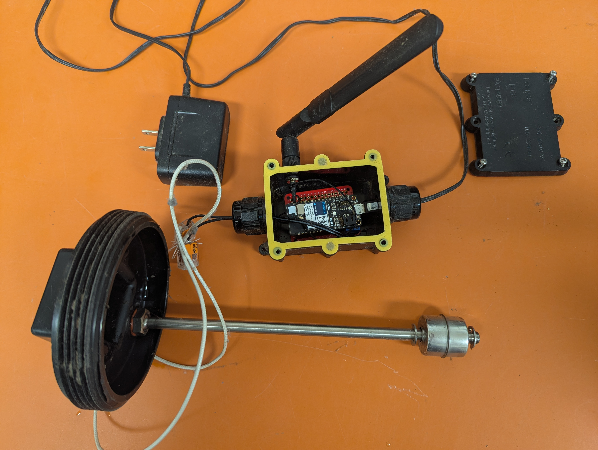
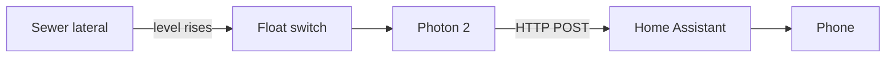
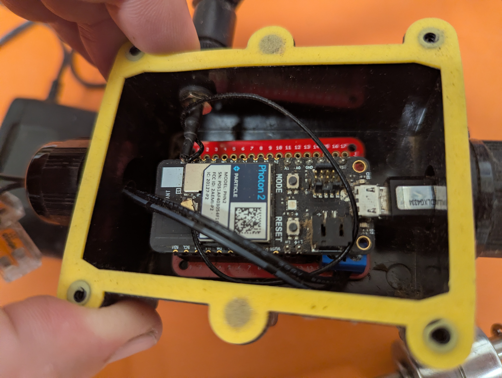

# SewerBackup Detector

This page is the build notes for a sewerBackup warning I installed at my house. The sewer lateral is long and has ongoing root problems, so an early warning is useful. Hardware is about $50–$75. Built July 2025.

Firmware: [`firmware/src/sewer-backup-detector.cpp`](firmware/src/sewer-backup-detector.cpp).



## Why

When a sewer lateral clogs, wastewater fills the pipe from the low point upward. The house is still draining into that volume. A toilet that will not flush is a late signal: much of the piping may already be full. Opening the cleanout then releases a vertical column of wastewater next to the house. The column is taller in a multi-story house.

A float in the cleanout can trip while the sewerBackup is still below the fixtures. How much time that gives you depends on the unused pipe volume between the float and the lowest fixture, and on how fast water is entering the sewer. This does not clear a clog.

## How it works

A magnetic float switch is mounted through a cleanout cap that has been drilled for the sensor. A Particle Photon 2 reads the switch and sends the state to Home Assistant on the LAN, either on change or once a minute. Home Assistant sends two notifications: one when the float is up, so you can stop draining water, and one when the Photon has stopped reporting, which usually means a loss of power, Wi-Fi, or Home Assistant.

Those alerts only arrive if Home Assistant can still reach your phone. It is advisable to set up a recurring notification simply to test that notifications, in general, are being delivered.

The Photon talks to Home Assistant with an HTTP POST on the LAN, on port 8123, the same port as the HA web interface. Nothing else to install. That is the path this project uses.

MQTT is optional if you already run a broker. MQTT is a publish/subscribe protocol. A *broker* is a program that accepts messages and hands them to subscribers. [Mosquitto](https://mosquitto.org/) is one such broker. Home Assistant is not Mosquitto; HA can *use* a broker. On Home Assistant OS, Mosquitto is typically an add-on on the same computer. MQTT gives HA a native sensor and last-will disconnect detection. HTTP notices silence with a webhook timestamp. Pick the transport in `config_and_secrets.h`.



## Parts and cost

| Item | What I used | ≈ |
|---|---|---:|
| Photon 2 | Particle Photon 2, with male headers | $18 |
| Proto board | 0.1" (2.54 mm) proto PCB; Photon 2 is not an Arduino Uno shield | $2–5 |
| Socket | Female headers so the Photon unplugs from the proto board | $1–2 |
| Terminal block | 2-position screw terminal on the proto board for the float pair | $1–2 |
| Float | Stainless vertical magnetic reed float, stem sized to the cleanout (see Build) | $8–15 |
| Cleanout cap | New 4" threaded PVC/ABS cap matching the existing cleanout, then modified | $5–15 |
| Enclosure | Helunsi IP68 junction box, Amazon `B07TGHYQF4` | $5–10 |
| Antenna | Dual-band paddle + U.FL pigtail, Amazon `B07R21LN5P` | $5–10 |
| Connectors | WAGO 221 at the cap so the cap still unscrews | $1–3 |
| Debug LED | On D7 (soldered on this build) | <$1 |
| Wire | 2-conductor from the box gland to the WAGOs | <$2 |
| Power | USB 5 V wall wart into the Photon’s USB jack | $5–10 |
| **Total** | | **$50–$75** |

Tools: drill and bits for the float gland, the antenna bulkhead, and the box glands; wire strippers; soldering iron; screwdriver. No custom PCB or 3D printing.

## What you need already

- A sewer cleanout you can open, and a new matching cap you are allowed to modify.
- Ability to work around sewage and sewer gas.
- Wi-Fi that reaches the cleanout, and the ability to flash a Particle board.
- Home Assistant on the LAN. MQTT is optional and needs a broker (the Mosquitto add-on on the same HA machine is enough).
- A disconnect at the cap so you can unscrew it and snake the line. The sensor wires should not tether the cap to the electronics box.

## Build

1. Measure the riser inside diameter and the depth from the underside of the cap to where the cleanout joins the lateral. The float hangs in that vertical pipe, as low as you can place it. It must not stick down into the lateral. In the running sewer it will catch paper and roots and can cause a clog. Order a stem that puts the whole float above that junction when the cap is tight.

2. Solder female headers onto a 0.1" proto board so the Photon 2 plugs in and can come out again. Solder a 2-position screw terminal onto the same board, on traces that land on **D2** and **GND**. Debug LED on **D7** (soldered on this build) to GND, with a series resistor unless the LED is a module. Do not hold D7 low at reset; that puts a Photon 2 into test mode. D2 is `INPUT_PULLUP`: closed contact (clear) is LOW, open contact (sewerBackup, or a cut wire) is HIGH. There is no useful Arduino-shield carrier for a Photon 2 in a box this small; the proto board is the part.

3. Home Assistant. Nothing to copy into `/config`.

   Settings → Devices & services → Helpers → Create helper. Use these names so the entity ids match the automations.

   - Text: **Sewer state**, maximum length 16.
   - Date and/or time: **Sewer detector last ok**, date and time both on.
   - Template, binary sensor: **Sewer cleanout float**, device class Moisture. State template:

     `{{ states('input_text.sewer_state') == 'ON' }}`

   - Template, binary sensor: **Sewer detector stale**. State template:

     `{{ states('input_datetime.sewer_detector_last_ok') in ['unknown', 'unavailable', ''] or (now() - states('input_datetime.sewer_detector_last_ok') | as_datetime | as_local).total_seconds() > 300 }}`

   Then Settings → Automations & scenes → Create automation. Name it **Sewer detector HTTP update**. Add trigger → **Webhook**. Home Assistant fills in a random webhook id; copy it (the copy button on the webhook URL). Put `/api/webhook/<that-id>` in [`firmware/src/config_and_secrets.h`](firmware/src/config_and_secrets.h) as `HA_WEBHOOK_PATH`, and the Home Assistant dotted-quad in `HA_HOST`. Gear next to the webhook id: POST only, local only.

   Add two actions in the same automation, or ⋮ → Edit in YAML and paste this under `actions:` without replacing the `webhook_id` Home Assistant wrote:

   ```yaml
   actions:
     - action: input_text.set_value
       target:
         entity_id: input_text.sewer_state
       data:
         value: "{{ trigger.json.state }}"
     - action: input_datetime.set_datetime
       target:
         entity_id: input_datetime.sewer_detector_last_ok
       data:
         timestamp: "{{ now().timestamp() }}"
   ```

   Suggested notify rules: Create automation → ⋮ → Edit in YAML, paste each of these as its own automation. Replace `notify.notify` with your phone (Developer tools → Actions, typically `notify.mobile_app_<name>`).

   ```yaml
   alias: SewerBackup
   mode: single
   triggers:
     - trigger: state
       entity_id: binary_sensor.sewer_cleanout_float
       to: "on"
   actions:
     - action: notify.notify
       data:
         title: SewerBackup
         message: Float is up. Stop draining water.
   ```

   ```yaml
   alias: Sewer detector silent
   mode: single
   triggers:
     - trigger: state
       entity_id: binary_sensor.sewer_detector_stale
       to: "on"
   actions:
     - action: notify.notify
       data:
         title: Sewer detector silent
         message: No timely updates. Check power, Wi-Fi, Home Assistant, and the Photon.
   ```

   MQTT instead: [`home-assistant/sewer-mqtt.yaml`](home-assistant/sewer-mqtt.yaml) and Firmware below. [`home-assistant/sewer-http.yaml`](home-assistant/sewer-http.yaml) is only the helpers, and only if you already use packages.

4. Flash Device OS 5.3 or later. Open `firmware/` in Workbench, or `particle compile p2 firmware` / flash OTA. Particle CLI and Workbench fetch HttpClient (and MQTT, if you switch) from `project.properties`. Web IDE: paste the `.cpp` and add HttpClient. Particle Cloud is used for OTA. The sewerBackup state stays on the LAN. Do this on the bench with USB before the board goes in the box.

5. Put the proto board in the IP68 box. Drill for the antenna bulkhead, feed the U.FL pigtail through, and click it onto the Photon. Fit cable glands. Run 2-conductor from the screw terminal out one gland, and USB power through another gland into the Photon’s USB jack. Close the lid. Fitting the board, glands, and antenna in the small box was the slowest mechanical step.

   

6. Drill the new cap on center. Mount the float with its gaskets so the cap still seals. Check that the float slides freely.

7. Screw the finished cap onto the cleanout first. Then join the float leads to the cable from the box with WAGO 221 connectors (or a weatherproof disconnect). The wires must not tether the cap to the box; you have to unplug to unscrew and snake the line. WAGOs are fine under a roof overhang. They are not rated as an outdoor weatherproof connector.

8. Power it. Lift the float for more than 2 seconds. `binary_sensor.sewer_cleanout_float` should go on (Wet) and the SewerBackup notification should fire. Unplug the Photon; within a few minutes the silent-detector notification should fire. Periodic reports do not prove the float still moves. Lift it occasionally.

```
USB 5V ── Photon 2 USB
Sensor ── D2   (INPUT_PULLUP)
Sensor ── GND
LED  ──── D7   (debug; soldered on this build)
LED  ──── GND  (series resistor unless the LED is a module)
```

## Firmware

[`firmware/src/sewer-backup-detector.cpp`](firmware/src/sewer-backup-detector.cpp) and [`firmware/src/config_and_secrets.h`](firmware/src/config_and_secrets.h).

There is no Device OS without a Photon. `python3 scripts/verify.py` parses the Home Assistant YAML and compiles the sketch on the host against the small fakes in `test/fakes/`. That is not a Device OS compile. For the board: `particle compile p2 firmware`, which pulls HttpClient and MQTT rather than keeping copies in this repo.

The Photon reports `ON` (sewerBackup) or `OFF` (clear) 2 s after the contact opens, immediately when it closes, and every 60 s either way. That is a Home Assistant moisture binary_sensor: `on` is Wet, `off` is Dry. Open circuit is a sewerBackup (float up or a cut wire). Automations decide whether a sewerBackup is an alarm. The 2 s delay is debounce. After a failed send it retries every 5 s. The hardware watchdog is 90 s. Home Assistant is notified first; Particle Cloud gets the same state afterward.

Particle Console already shows whether the Photon is online. Firmware also publishes `sewer-state` (`ON`/`OFF`) on change, and `sewer-ha` if the Home Assistant send fails or later recovers. The 60 s heartbeat stays on the LAN. USB serial (`particle serial monitor`) has the same change events plus debounce; it does not print a line every minute.

**HTTP** (default): POST `{"state":"ON"}` or `{"state":"OFF"}` to `/api/webhook/<id>` on Home Assistant port 8123. Put a dotted-quad in `HA_HOST`. Home Assistant treats the detector as silent if the webhook timestamp is older than 5 minutes.

```cpp
#define SEWER_TRANSPORT_HTTP
const char* HA_HOST = "192.168.0.2";
const int HA_PORT = 8123;
const char* HA_WEBHOOK_PATH = "/api/webhook/<id-from-the-webhook-automation>";
```

**MQTT** (optional): uncomment `SEWER_TRANSPORT_MQTT` instead, add the MQTT library, and use [`home-assistant/sewer-mqtt.yaml`](home-assistant/sewer-mqtt.yaml). Install a broker, create a user, and do not expose port 1883.

| Topic | Payload | When |
|---|---|---|
| `sewer/state` (retain) | `ON` / `OFF` | state change and every 60 s |
| `sewer/availability` (retain) | `online` | MQTT connect |
| `sewer/availability` (LWT) | `offline` | Unclean disconnect |

Keepalive is 60 s. The library default is 15 s, which is short enough that Mosquitto will drop the client.

LAN HTTP and MQTT are unencrypted. Do not send them across the internet.

## Failure modes

| Failure | What happens | What to do |
|---|---|---|
| Float jammed with debris | Stays clear (`OFF`) | Inspect after every trip. Lift-test on a schedule. |
| Float hanging into the lateral | Catches debris and can clog the line | Size the stem as in Build step 1. |
| Cut sensor wire | Reports sewerBackup (`ON`) | Same signal as a real sewerBackup. Distinguishing the two needs a different circuit. |
| Power, Wi-Fi, or Photon down | No webhook for 5 min (HTTP) or MQTT last-will | Silent-detector alert. |
| Home Assistant or phone notifications down | No remote alert | Recurring notification test, as in How it works. |
| HTTP or MQTT call hangs | Loop stops | Hardware watchdog resets after 90 s. |

Opening a sanitary sewer exposes you to pathogens and hydrogen sulfide. Keep the cap sealed. Follow local plumbing code.

## Later changes worth making

- Weatherproof disconnect at the cap instead of WAGOs, if the cleanout is exposed.
- Supervised loop (two resistors) so an open wire, a raised float, and a short are three different states.
- A local sounder that does not depend on Home Assistant.
- MQTT over TLS, if you use MQTT and the broker is not on a trusted LAN.

License: MIT. This is an early warning, not a life-safety system.
