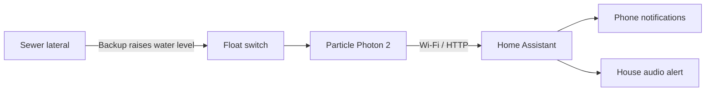

# Smart Sewer Backup Detector

A low-cost Wi-Fi connected early-warning system for detecting a clogged residential sewer lateral before the backup reaches toilets, showers, or other fixtures inside the house.

**Built:** July 2025  
**Platform:** Particle Photon 2 + Home Assistant  
**Estimated hardware cost:** approximately $50–$75 [TODO: update from actual purchases]

[PHOTO: Finished detector installed beside cleanout]

## The Problem

Our house has a long sewer lateral with significant root intrusion. The line can be maintained, but realistically it will never be perfect. A blockage remains something we have to plan for.

Without monitoring, the first indication of a clog may be a toilet that suddenly refuses to flush—or a guest discovering it for us. By that point, wastewater may already have backed up through much of the lateral.

I wanted a way for the house to detect the backup itself and warn us as early as practical.

Commercial searching didn't turn up a product I was happy with. I found at least one purpose-built device online, but availability was unclear and the product did not appear to be readily purchasable.

The eventual DIY solution turned out to be surprisingly simple.

## How It Works

A vertical float switch is mounted through a replacement sewer cleanout cap.

During normal operation, the cleanout riser is empty and the float hangs in its normal position.

If the sewer lateral becomes obstructed, wastewater begins backing up through the pipe. As the level rises into the cleanout, it lifts the float. A magnetic reed switch inside the sensor changes state and a Particle Photon 2 microcontroller detects the change.

The Photon filters transient readings and reports the sensor state over Wi-Fi to Home Assistant.

Home Assistant then handles the alarm—including phone notifications and, in my installation, playing Queen's **"Under Pressure"** over the house speakers.

The music is optional.

### System architecture



## Why a Float Switch?

There are many ways to detect liquid: conductivity probes, pressure sensors, optical sensors, ultrasonic ranging, and so on.

For this application I preferred a float switch because the physical problem is extremely simple: **is sewage rising into a pipe that should normally be empty?**

A float switch provides a direct mechanical answer to that question.

It also allowed me to choose a sensor whose dimensions matched the depth and geometry of my particular cleanout. That determines how low in the cleanout the alarm threshold can be placed.

The lower the sensor can practically be positioned, the earlier the warning.

Actual warning time depends on several factors:

- location and severity of the blockage;
- household water-use rate;
- sensor height;
- diameter and length of the sewer piping; and
- volume available below the lowest plumbing fixtures.

The system therefore doesn't promise a particular number of minutes of warning. Its purpose is simply to detect the rising wastewater as early as practical.

## Mechanical Construction

The mechanical portion of the project is intentionally simple.

I purchased a replacement threaded cleanout cap from a hardware store and drilled a hole through its center for the float-switch stem.

[PHOTO: Replacement cleanout cap and float sensor before assembly]

The float sensor included sealing gaskets and hardware. It mounts through the drilled opening and seals against the cap.

The cleanout size itself isn't fundamental to the design. My installation uses a [TODO: 4-inch/5-inch] cleanout, but the same idea can be adapted to other cleanout sizes by purchasing the appropriate replacement cap.

### Keep the cleanout serviceable

A sewer cleanout still needs to function as a sewer cleanout.

The detector therefore cannot permanently tether the cleanout cap to the electronics enclosure.

I connected the float-switch wires using WAGO lever connectors so the sensor can be disconnected quickly and the entire cleanout cap unscrewed whenever the lateral needs normal plumbing service.

This was convenient because I already had WAGO connectors available. They are not the ideal weather-exposed connector for every installation, however. My cleanout is protected beneath a house overhang.

A future version would use a more purpose-built removable weather-resistant connector.

## Electronics

The controller is a **Particle Photon 2** Wi-Fi development board.

I chose Particle largely because its Device OS and cloud infrastructure make remotely updating the application firmware straightforward. Once the detector is installed outdoors, I can modify and deploy firmware without opening the enclosure and connecting the board to my development computer.

My installation also uses an external dual-band Wi-Fi antenna connected to the Photon 2.

The electronics are installed inside a small IP68-rated external junction box.

[PHOTO: Junction box open showing Photon 2, terminal connections, and antenna connection]

Fitting everything inside the small enclosure was actually the most difficult part of the physical build.

I soldered terminal blocks onto the Photon 2 to make the field wiring easier to connect and service.

### Wiring

[DIAGRAM TODO]

The electrical circuit is essentially:

```text
Float reed switch
       │
       ├──────── Photon 2 GPIO
       │
       └──────── GND / supply as appropriate
```

[TODO: Replace this with exact GPIO and pull-up/pull-down configuration from source code.]

There is no custom PCB.

## Bill of Materials

| Item | Example / part used | Qty. | Approx. cost |
|---|---|---:|---:|
| Wi-Fi microcontroller | Particle Photon 2 | 1 | ~$18 |
| Vertical magnetic float/reed switch | [TODO: exact part/link] | 1 | ~$8–15 |
| Replacement threaded sewer cleanout cap | Hardware-store PVC/ABS cap matching cleanout | 1 | ~$5–15 |
| Weather-resistant electronics enclosure | Helunsi IP68 external junction box, Amazon ASIN B07TGHYQF4 | 1 | ~$5–10 allocated from 2-pack |
| External Wi-Fi antenna + U.FL pigtail | Dual-band antenna kit, Amazon ASIN B07R21LN5P | 1 | ~$5–10 allocated from kit |
| Removable wire connectors | WAGO lever connectors | 2 | ~$1–3 |
| PCB terminal blocks | [TODO: exact type] | as needed | ~$2–5 |
| Hookup wire | Commodity | as needed | <$2 |
| Power supply/cable | [TODO: describe actual power supply] | 1 | ~$5–10 |
| **Estimated total** | | | **~$50–$75** |

Prices are approximate and should be treated as a guide rather than a current shopping list.

### Tools

- Drill and appropriately sized drill bit
- Wire strippers
- Soldering iron
- Basic hand tools

No machining, custom PCB fabrication, or 3D printing is required.

## Software

The Photon runs a small C/C++ application on Particle Device OS.

Its responsibilities are deliberately limited:

1. read the float-switch input;
2. reject transient readings so a single anomalous sample does not cause an alarm;
3. periodically report its state; and
4. send state changes to Home Assistant over HTTP.

[LINK: `firmware/`]

Home Assistant is responsible for higher-level automation and notification.

In my installation, a confirmed sewer-backup state causes Home Assistant to:

- send notifications to my phone; and
- announce the problem through the house speaker system.

The particular Home Assistant automations are not fundamental to the detector. An installation could instead trigger lights, sirens, SMS notifications, or any other automation supported by the homeowner's system.

## Monitoring the Monitor

An alarm system isn't very useful if it quietly stops working.

The Photon therefore continues reporting sensor status during normal operation. Home Assistant watches for those updates and sends me a monthly notification confirming that it is still receiving them.

This provides a health check for:

- the Photon;
- its power supply;
- Wi-Fi connectivity;
- communication with Home Assistant; and
- the Home Assistant monitoring automation itself.

It does **not** prove that the mechanical float is still able to move.

A complete functional test requires physically lifting the float and confirming that the resulting alarm reaches Home Assistant and the configured notifications fire.

That distinction is important.

## Testing

Testing does not require deliberately clogging the sewer.

Before installation, the float can be checked in water if desired.

Once the firmware and Home Assistant integration are configured, simply lift the float manually and hold it in the alarm position.

A successful end-to-end test should demonstrate:

1. the Photon recognizes the sustained switch state;
2. transient filtering does not prevent a legitimate alarm;
3. Home Assistant receives the state change; and
4. every important notification mechanism activates.

I recommend periodically repeating this physical test because an electronic heartbeat cannot detect a mechanically stuck float.

## Failure Modes and Limitations

### Float fouling

The biggest mechanical concern is accumulation of material that prevents the float from moving freely.

In this application the sensor is normally suspended in an empty cleanout rather than continuously submerged in wastewater. It should therefore see contamination primarily during actual backup events.

Nevertheless, the float should be inspected and cleaned after an activation and periodically tested for free movement.

### Loss of power, Wi-Fi, or Home Assistant

The detector depends on power, Wi-Fi, and Home Assistant to deliver its remote alerts.

The periodic status messages allow Home Assistant to detect many communication failures, but the system does not provide an independent local alarm if the entire home automation infrastructure is unavailable.

### Warning time

This is an early-warning detector, not a device that prevents a sewer backup.

How much warning it provides depends heavily on the plumbing geometry and how much water is being discharged into the house sewer after the obstruction occurs.

### Plumbing and sanitation

Opening or modifying access to a sanitary sewer can expose the installer to sewage and sewer gases. Installation should preserve the normal function and sealing of the cleanout, and local plumbing requirements should be followed.

## What I'd Change in Version 2

The basic sensing concept has worked well enough that I would keep it.

The first thing I would improve is the removable connection between the cleanout-mounted sensor and the electronics enclosure. WAGO lever connectors are convenient in my protected installation, but a compact weather-resistant plug-and-socket connector would make a better general-purpose design.

I would also consider improving system diagnostics so that a disconnected or broken sensor wire can be distinguished from the normal "no backup" state.

## Why I Built It

The part of this project I'm happiest with isn't the electronics.

It solves a real problem for my family.

In retrospect, I spent too much time searching for a commercial sewer-backup detector because I assumed buying something would save time. Once I stopped searching and approached it as an engineering problem, the actual solution was inexpensive and straightforward.

Building it myself also provided something a generic commercial product could not: I could choose the exact float-switch geometry appropriate for my cleanout and position the detection point to maximize the available warning time.

Sometimes the simplest sensor is enough.

## Source Code

- [`firmware/`](./firmware/) — Particle Photon 2 firmware
- [`home-assistant/`](./home-assistant/) — [TODO: optional HA example configuration]

## License

[TODO: Choose software and hardware/documentation licenses.]